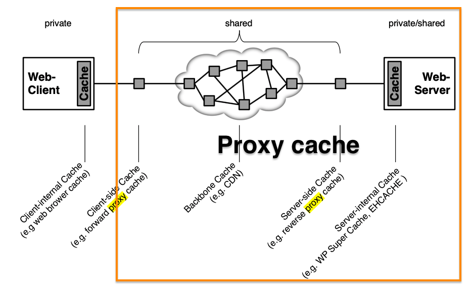
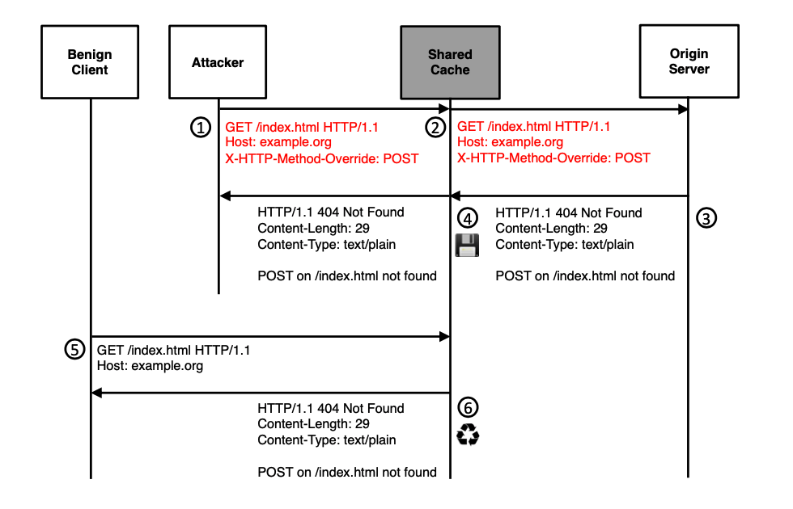

# Your Cache Has Fallen

- CPDoS 공격  

  - 원인 : 같은 메세지를 HTTP Engine (CDN and origin HTTP server)에서 다르게 해석

  - 결과 : 서버로부터 생성된 에러 페이지가 캐쉬로 저장되어 서비스 이용이 불가 (즉, 네트워크 트래픽을 이용해서 서버를 마비시켜 서비스를 이용 불가능 하게 하는 것이아닌, 클라이언트 side에서 잘못된 캐쉬를 저장시키고 계속 호출 시킴으로써, 서비스 이용이 불가능하도록 하는 것 같음)

  - 장점 : 하나의 request 만으로, poisioning 할 수 있어서, WAF (Web Application Firewall) 이나 DDoS protection의 threshold에 걸리지 않음 (이전의 연구는 많은 트래픽을 발생 시켜서 하는 DoS 공격이었음)

  - |                      | Traditional DDoS | CPDoS |
    | :------------------- | :--------------: | :---: |
    | effort               |       High       |  Low  |
    | detection posibility |       High       |  Low  |
  
  - basic attacker capabilities 가지고, 하나의 requests로 해당 서비스를 마비시킬수 있다고 하는데, 논문적 허풍인지 읽어보도록 하자구~

  - Cache는 DoS Attack을 완화 시키기위해서도 사용되는데, 역설적으로 Cache가 DoS의 공격이 될 수도 있다는 것을 언급하고 있네~

- Intermediate systems 
  - Caches
  - Firewalls
  - Load balancers
  - Document routers and filters

- Cache

  - Used for reduce network traffic and optimizes application performance 
  - Stored recyclabe responses with the aim to reuses them for recurring client requests
  - Web Cache solutions may consists of cache proxy and CDN
  - Types
    - Client-internal cahces of web browsers 
      - provide response for a dedicated user only
    - Client-side and server-side caches A.K.A CNS, proxy cache
      - provide response for a multiple users
    - 
    
  - Defined in RFC 7234
  - `GET` method can stored as cache even no explicit caching directive is present in a response implicitly 
    - But, `POST, DELETE, PUT` methods are not allowed to be cached 

  

- Experiments
  - Target : They analyze fifteent web caching solutions
  - Result : They found one proxy and 5 CDN services that are vulnerable to this attack (CPDoS)
  - Investigate cacheable error code summurized in **Table 1** 
  - Investigate that popular CDNs do store and resuse error codes using ***Nhuyen et al*** tool.
- Contributions
  - CPDoS (Cache-Poisoned Denial-of-Service) Attack, in which error pages are generated by origin servers and then stored and distributed by caching systems.
  - Found 5  CDN and 1 vulnerable caching solutions and report CERT/CC
  - Countermeasures

- Keywords
  - `max-age ` (second)
    - private cache
    - shared caches
  - `s-maxage` (second)
    - shared caching system
  - `Expires`  (absolute date)
    - private cache
    - shared caches
  - `must-revalidte, proxy-revalidate, no-cache` in `Cache-control` 
    - those keywords can control directives when content is expired or no freshness liftime information is available

- Static contents (can be cached)

  - Image

  - scripts

  - stylesheets

  - 404 (Not Found), 405 ( Not Allowed) page

    

- Web Cache Threats

  - All introduced attacks aim at poisoning shared caches with malicious content (`request smuggling, host of trobules, response splitting`) , Also web browser ache are not affected by those attacks. But, there are some attack that effect browsers (e.g., BCP Attack)
  - The root caouse of almost all of the Web Cache attacks lies in the differnect interpretation of HTTP messages (i.e., **semantic gap**)
  - Triukose et al, showed DoS Attack 

- Targets (There is no reference about popularity)

  - Proxies

    - Apache HTTP Server v2.4.18
    - Nginx v1.10.3
    - Varnish v6.0.1
    - Apache Traffic Server (Apache TS) v8.0.2
    - Squid v3.5.12

  - CDNs

    - Akamai
    - CloudFront
    - Cloudflare
    - Stackpath
    - Azure
    - CDN77
    - CDNsun
    - Fastly
    - KeyCDN
    - G-Score

    

- HTTP Method Override Attack
  - REST-based web service에서는 GET, POST, DELETE, PUT, PATCH method를 지원해야 하나, 어떤 intermediate system (e.g., proxies, load balancer, caches or firewall) 에서는 GET, POST만 지원하는 경우도 있음. 
  - 위의 경우에 호환을 위해서 `X-HTTPMethod-Override, X-HTTP-Method, X-Method-Override` 등을 사용함 
  - 이 헤더들은 보통 intermediate system으로 전달됨
  - 

- HTTP Header Oversize Attack
  - request header의 size limit이 표준으로 정의되어 있지 않음
  - 대부분의 웹서버나 프록시 캐시는 request header overflow나 ReDoS를 방지하기 위해서 8000 바이트로 제한하고 있으나, intermediate system은 8000이상인 경우도 존재함 (e.g., ColoudFront CDN 24,713 bytes)
  - 따라서, Attacker가 intermediate system이 허용하는 크기보다 작은 헤더 길이와 origin server가 허용하지 않는 길이 사이를 보낸다면 error page (또는 응답없음, summerized in **Table 3**) 를 cache 하게 될 것임
  - 

