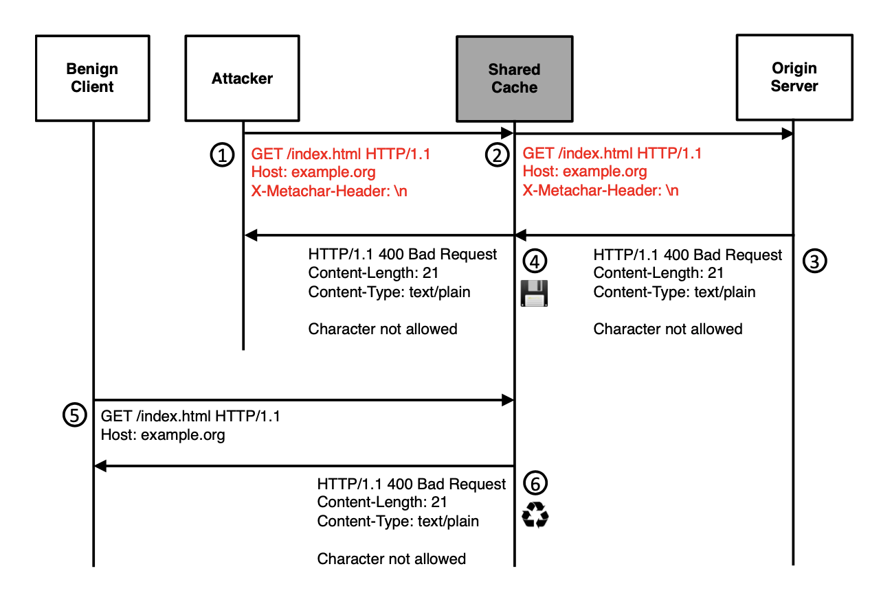

# Your Cache Has Fallen

- CPDoS 공격  

  - 원인 : 같은 메세지를 HTTP Engine (CDN and origin HTTP server)에서 다르게 해석

  - 결과 : 서버로부터 생성된 에러 페이지가 캐쉬로 저장되어 서비스 이용이 불가 (즉, 네트워크 트래픽을 이용해서 서버를 마비시켜 서비스를 이용 불가능 하게 하는 것이아닌, 클라이언트 side에서 잘못된 캐쉬를 저장시키고 계속 호출 시킴으로써, 서비스 이용이 불가능하도록 하는 것 같음)

  - 장점 : 하나의 request 만으로, poisioning 할 수 있어서, WAF (Web Application Firewall) 이나 DDoS protection의 threshold에 걸리지 않음 (이전의 연구는 많은 트래픽을 발생 시켜서 하는 DoS 공격이었음)

  - |                      | Traditional DDoS | CPDoS |
    | :------------------- | :--------------: | :---: |
    | effort               |       High       |  Low  |
    | detection posibility |       High       |  Low  |
  
  - basic attacker capabilities 가지고, 하나의 requests로 해당 서비스를 마비시킬수 있다고 하는데, 논문적 허풍인지 읽어보도록 하자구~

  - Cache는 DoS Attack을 완화 시키기위해서도 사용되는데, 역설적으로 Cache가 DoS의 공격이 될 수도 있다는 것을 언급하고 있네~

- Intermediate systems 
  - Caches
  - Firewalls
  - Load balancers
  - Document routers and filters

- Cache

  - Used for reduce network traffic and optimizes application performance 
  - Stored recyclabe responses with the aim to reuses them for recurring client requests
  - Web Cache solutions may consists of cache proxy and CDN
  - Types
    - Client-internal cahces of web browsers 
      - provide response for a dedicated user only
    - Client-side and server-side caches A.K.A CNS, proxy cache
      - provide response for a multiple users
    - 
    
  - Defined in RFC 7234
  - `GET` method can stored as cache even no explicit caching directive is present in a response implicitly 
    - But, `POST, DELETE, PUT` methods are not allowed to be cached 

  

- Experiments
  - Target : They analyze fifteen web caching solutions, 13 web frameworks 
  - Result : They found one proxy and 5 CDN services that are vulnerable to this attack (CPDoS)
  - Investigate cacheable error code summurized in **Table 1** 
  - Investigate that popular CDNs do store and resuse error codes using ***Nhuyen et al*** tool.
  - Step
    1. web framework (ASP.NET v2.2, BeeGo v1.10.0, Django v2.1.7, Express.js v.4.16.4, Flask v1.0.2, Gin v1.3.0, Laravel v5.7, Meteor.js v1.8, Rails v5.2.2, Play Framework 1 (Play 1) v1.5.1, Play Framework 2 (Play 2) v2.7, Spring Boot v2.1.2 and Symfony v4.2.)에서 지원하는 method override header 조사 및 method override header가 origin server에서 구현되어있지 않을 경우 나타나는 에러 페이지 조사
    2. web framework 및 **Table 1**에 있는 caching systems에 대하여 Request header limit 조사 이때 ASP.NET과 Spring Boot은 production mode로 실행하였음 + IIS v10.0.17763.1 and Tomcat v9.0.14도 실험함 (~~왜 갑자기 추가로 실험했는진 모르겠음~~) + popular cloud services (Amazon S3, Github, Gitlab. Google Storage, HeroKu)
       - production mode : 실제 운용 모드로써, 캐싱이 사용됨 (The `Production` environment is the environment in which the application runs when it is live and being used by end users.)
    3. 위에서 언급한 web framework, caching system, web server and cloud service에 대해서 meta character를 조사했음. 520개의 meta character (control, special, international,  unicode, XSS, SQL injection, rce pattern)를 만들었음.
- Contributions
  - CPDoS (Cache-Poisoned Denial-of-Service) Attack, in which error pages are generated by origin servers and then stored and distributed by caching systems.
  - Found 5  CDN and 1 vulnerable caching solutions and report CERT/CC
  - Countermeasures

- Keywords
  - `max-age ` (second)
    - private cache
    - shared caches
  - `s-maxage` (second)
    - shared caching system
  - `Expires`  (absolute date)
    - private cache
    - shared caches
  - `must-revalidte, proxy-revalidate, no-cache` in `Cache-control` 
    - those keywords can control directives when content is expired or no freshness liftime information is available

- Static contents (can be cached)

  - Image

  - scripts

  - stylesheets

  - 404 (Not Found), 405 ( Not Allowed) page

    

- Web Cache Threats

  - All introduced attacks aim at poisoning shared caches with malicious content (`request smuggling, host of trobules, response splitting`) , Also web browser ache are not affected by those attacks. But, there are some attack that effect browsers (e.g., BCP Attack)
  - The root caouse of almost all of the Web Cache attacks lies in the differnect interpretation of HTTP messages (i.e., **semantic gap**)
  - Triukose et al, showed DoS Attack 

- Targets (There is no reference about popularity)

  - Proxies

    - Apache HTTP Server v2.4.18
    - Nginx v1.10.3
    - Varnish v6.0.1
    - Apache Traffic Server (Apache TS) v8.0.2
    - Squid v3.5.12

  - CDNs

    - Akamai
    - CloudFront
    - Cloudflare
    - Stackpath
    - Azure
    - CDN77
    - CDNsun
    - Fastly
    - KeyCDN
    - G-Score

    

- HTTP Method Override Attack
  - REST-based web service에서는 GET, POST, DELETE, PUT, PATCH method를 지원해야 하나, 어떤 intermediate system (e.g., proxies, load balancer, caches or firewall) 에서는 GET, POST만 지원하는 경우도 있음. 
  
  - 위의 경우에 호환을 위해서 `X-HTTPMethod-Override, X-HTTP-Method, X-Method-Override` 등을 사용함 
  
  - 이 헤더들은 보통 intermediate system으로 전달됨
  - 
  - 
  
  - Fastly, Akamai, Cloudflare, CloudFront, CDN77, Varnish를 Cache system으로 사용하는 Flask와 Play1에 대해서만 CPDoS Attack에 대해 Vulnerable 하다.
  
    - Flask - Akamai, CloudFront 를 이용할 경우 vulnerable, because only those cache system cache 405 error code
    - Play1 - Akamai, CDN77, Cloudfale. CloudeFront, Varnish를 이용할 경우 vulnerable
  
  - Laravel, Symfony, Django, Express.js 는 GET method에 method overriding 이 있는 경우 해당 필드를 무시하고, POST 인 경우에만 적용 함. 따라서, vunerable 하지 않음 (Cache는 GET Method만 할 수 있음)
  
    
  
- HTTP Header Oversize Attack
  - request header의 size limit이 표준으로 정의되어 있지 않음
  
  - 대부분의 웹서버나 프록시 캐시는 request header overflow나 ReDoS를 방지하기 위해서 8000 바이트로 제한하고 있으나, intermediate system은 8000이상인 경우도 존재함 (e.g., ColoudFront CDN 24,713 bytes)
  
  - 따라서, Attacker가 intermediate system이 허용하는 크기보다 작은 헤더 길이와 origin server가 허용하지 않는 길이 사이를 보낸다면 error page (또는 응답없음, summerized in **Table 3**) 를 cache 하게 될 것임

  - 즉, 하나의 헤더 필드를 큰 사이즈로 하거나, 많은 헤더 필드들을 만들어 oversize 되게 함
  
  - 
  
  - 
  
  - 위의 표에서 ASP.NET, Django, Flask, Laravel, Rails, Symfony and Spring Boot은 사용자가 limit을 설정할 수 있으므로, 제외하였다.
  
  - 논문에서 Cloundfront를 예로 설명하고있으며, 이 limit보다 낮은 웹 프레임워크, engine, or service를 이용하고, 400 에러를 리턴하는 서비스라면 CPDoS에 취약할 수 있다.
  
  - 400에러를 리턴하지 않고, response가 없더라도, CDN에서 error code를 리턴할 수도 있음. 마찬가지로 이때 CPDoS에 취약함 (e.g., Play1 with CDN cloudfare. Play1은 response가 없으나, CDN에서 응답을 기다리다가 시간이 초과 되는 경우 client 측으로 502 error code를 보내고 이를 캐시함)
  
  - 413 Error code에 대해서는 CDN이 cache되지 않음. 따라서, end point < limit < CDN 이더라도, 취약하지 않을 수 있음
  
  - Nginx에서 보안모듈 (ModSecurity)가 적용된 경우에는 오히려 CPDoS Attack 하기 더 쉬웠음 (이를 통해, 보안 모듈이 오히려 보안을 떨어뜨릴 수 있다는 것을 지적하고 싶어하는 듯)
  
  - IIS의 경우 옵션에 따라 헤더 크기를 제안하는 옵션을 설정할 수 있으며 설정되는경우 404에러를 리터하는데 이는 또 CDN에서 캐쉬될 수 있음 (즉, 무조건 limit으로만 비교될 게 아니라 설정이나 환경에 따라 CPDoS이 성공할 수 있음)
  
    
  
- HTTP Meta Character Attack
  - Meta Character (e.g., `\r, \n`)을 이용한 공격 기법으로 origin server의 경우 보안 목적으로 Meta Character를 block 하고, error page를 return 하는 경우도 있는 반면 intermediate system는 Meta Character를 parsing 하지 않는 경우도 있다. 이때, 캐시가 저장되어 공격이 가능해진다 (i.e., just forward to origin server).
  - 
  - 
  -  ASP.NET, Django, Flask, Laravel, Spring Boot and Symfony는 설정에 따라 달라질 수 있으므로 위의 테이블에서 생략하였음
  - control character는 대부분 threat으로 간주해서 error code를 리턴하거나 header에서 삭제함
  - Apache HTTPD와 CloudFront 를 예에 PPT에 넣으면 될 듯 
  - 마찬가지로 Express.js가 CDN을 Cloudfront를 사용할 때  Express.js에 multiple character를 보내는 경우,  CDN에서 502 bad request를 client에게 보내고 cache함

- 요약
  - 

- Countermeasures
  - 에러 response를 생략하는 것 (CDN에서 옵션 제공)
  - 또는 end point에서 에러 메세지를 보낼때 `no-store` or `cach-control` 을 이용해서 캐쉬 되지 않도록 함 (저자들의 실험에서 cloudfront를 제외하고는 `no-store` 옵션을 추가해도 여전히 캐시하였음)
  - HTTP Standard로 정의된 error code만 캐시하도록 하여야함 (only store error codes which are permitted by the HTTP standard)
  - WAF (Web Application Firewall)의 사용 (CDN들은 WAF 옵션을 제공함) 다만, 이때 origin server로 전달되기 이전에 차단되어야 함 (i.e., CDN에서 막아야 할듯)
  - HTTP Header overridding 취약점의 경우 POST method인 경우에만 X-HTTP-Method-Override등의 헤더를 보는 방식으로 함

- Conclusion
  - They proposed a new class of attack called Cache-Poisoned Denial-of-Service
  - They found 30% of Alxa Top 500 may vulnerable and mission-critical firmware and update files (e.g., nasa.gov, ethereum.org, marines.com)